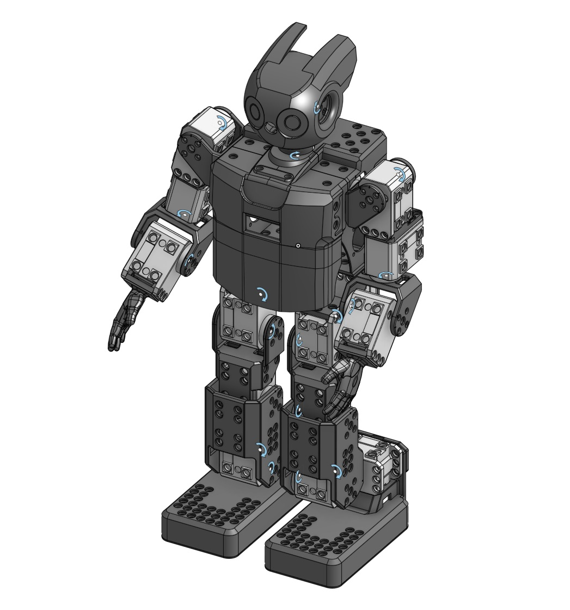

# pd1-3d
[PD1](https://github.com/sonelu/pd1) is a low cost hummanoid robot based on he [Robotis Darwin Mini](http://en.robotis.com/index/product.php?cate_code=121310) robot, heavily customized to accomodate more degrees of freedom, additional sensors, a more performant on-board SoC and Dynamixel interface, higher battery capacity with hot-swap capabilities, etc. The software is based on the [poppy-project pypot](https://github.com/poppy-project/pypot) library and many of the features of the PD1 are reflecting the [poppy-hummanoid](https://github.com/poppy-project/poppy-humanoid) robot.

This repository contains the [3D parts](STL/README.md) needed for the construction of the robot. Please note that most of the standard Darwin Mini parts have been changed and only a very limited numer of Robotis frames can still be used.

The [overview](STL/README.md) in the STL folder indicate the number of parts that need to be printed for a complete robot assembly and if this is a completely new, a modified or an unchanged Robotis part.

The [assembly](assembly) directory contains instructions for the assembly of the PD1 robot. Please note that in addition to the STL parts contained in this repository there are refereces to other github repositories that have details about other parts (mainly electronics) that are used in the PD1 robot.